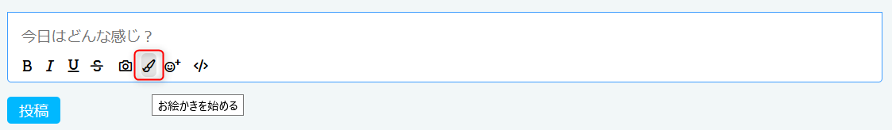

# SudoHaiku完全攻略Wiki
## このヘルプについて
[SudoHaiku](https://h.sudo.ne.jp/) でよく見かける？質問を2boが雑にまとめたものです。  
SudoHaikuは開発が現在も進んでいるため、この内容の正確性は保証されません。

## SudoHaikuについて
このページを読んでいる時点で説明は不要だと思いますが、[SudoHaiku](https://h.sudo.ne.jp/) はアメリカ在住の[Sudofox](https://profile.hatena.ne.jp/austinburk/) さんが個人で
[はてなハイク](http://h.hatena.ne.jp/) に似せて開発しているサービスです。

**認証等ははてなのサービスを利用していますが、はてな社が提供しているサービスではありません**

## よくある質問
### 登録時の許可内容について

SudoHaikuへの初回ログイン時、以下画像のようなはてなとの連携許可が求められます。
セキュリティに気をつけている方は権限が多いと気になるかもしれません。

[Sudofoxさんの回答](https://h.sudo.ne.jp/austinburk/entry/291966505422295040)は以下となります。(2boの意訳ですので正確な情報は上記リンクを確認ください。)

- プライベート情報を含む情報の読み取りと書き込み、削除  
  はてなフォトライフへのアップロード、アップロード後の検証をするために必要となります。

- プライベート情報を含む情報の読み取り  
  通知のために必要です。SudoHaikuで通知を生成し、はてなからのお知らせを利用して通知しています。

- 公開情報の読み取りと書き込み、削除  
  はてなブックマークとの連携機能のために必要です。  
  なお、この機能は現在開発中です。

- 公開情報の読み取り  
  認証やはてなIDの確認のために必要です。

### 画像の取り扱い
#### 画像のアップロード先
SudoHaikuでは画像をアップロードすると [はてなフォトライフ](https://f.hatena.ne.jp/) にアップロードされます。  
アップロードされた画像はフォルダ「Sudo::Haiku::Web」(デフォルトで公開範囲は「自分のみ」)に保存されます。  
なお、フォトライフにアップロードされるため、フォトライフの制限である「アップロードは毎月300MBまで」の制限が適用されます。

**当初はSudoHaikuの投稿を削除するとフォトライフ上の画像も削除する設定でしたが、懸念点があり現在は削除されないように「一時的」に変更されています。**

#### フォトライフのアップロード制限回避方法
フォトライフでは「アップロードは毎月300MBまで」の制限があるため、フォトライフの設定によっては数枚の画像をアップロードするだけで上限を超えてしまいます。
フォトライフで以下の設定をすることでアップロードサイズを抑えることができます。

- 設定内容
    1. 画像サイズを600ピクセル程度にする
    2. 「オリジナルサイズの画像を保存」のチェックを外す

なお、フォトライフのアップロード容量制限は [はてなブログPro](https://hatenablog.com/guide/pro) に登録(有料)することで、アップロード容量制限を毎月3GBに増加させることが可能です。
※ [はてなフォトライフプラスは終了の案内がされています。](https://hatena-announce.hatenastaff.com/entry/2020/12/11/155009)  

#### コピー&ペーストでの貼り付け
Webブラウザ上で他のページの画像を右クリック・コピーしSudoHaikuに貼り付けて投稿する画像も表示され、一見投稿できるように見えます。

しかし、SudoHaiku側ではURLでの書き込みとして認識され、フォトライフにはアップロードされないため、1日程度経過した後に画像が見えなくなります。

OSとブラウザの組み合わせで現象の発生度合いは変わりますが、現在はコピー&ペーストで画像を投稿するのは避けたほうがいいです。

**詳しい人向け**
確認したい場合は以下の画像のようにWebブラウザの開発者ツールでアップロードした画像のURLを確認してください。  
フォトライフのURLではなく、他のページのURL(画像ではgoogle)となっている場合はフォトライフにアップロードされず、数日で画像が見えなくなります。

### iPhone(iOS)環境でスターが付けられない
[cubickさんの投稿より](https://h.sudo.ne.jp/cubick/entry/293654149302718464)  

iOSではセキュリティのためサードパーティクッキーがブロックされています。  
以下のどちらかの対応で回避することが可能です。  

1. サードパーティクッキーの許可する  
  - Safari の場合  
    設定 > Safari > 「サイト越えトラッキングを防ぐ」をオフに変更  
      
  - Chrome 等の場合  
    設定 > (ブラウザ) > 「サイト越えトラッキングを許可」をオンに変更  
    
2. Firefoxをインストールする

### はてな記法は使える？

- 本文中のURLは自動でリンクされますが、`[https://～～～:title]` のような形式でリンクにタイトルを設定することはできません。

現状使用できるのは…

- `id:XXXXX` 形式のid記法。 (SudoHaiku内で該当ユーザページへのリンクに変換される。現状では"idコールされた"という通知はされない？)
- `f:id:XXXXX:XXXXX:image` 形式のfotolife記法。画像がインライン (埋め込み) で表示されます。

※ [Sudofoxさんの発言](https://h.sudo.ne.jp/austinburk/entry/294289313666043904) によれば、上記以外にも今後機能を拡張する予定ではあるとのこと。

### お絵かき機能について
2021/6/27 お絵かき機能が実装されました。  

#### 起動方法
- 投稿欄にある「お絵かきを始める」を選ぶとお絵かきが起動します。  
    
  
#### 使い方等
- 保存先はフォトライフになります。
- OS、ブラウザによって色選択画面が異なります。
- 前面と背面の2レイヤーが使えます。
- iPhone等の筆圧が扱える機材では筆圧が反映されます。  
  なお、現在はApple Pencilでは筆圧がうまく扱えない状態です。  
  [Sudofoxさんの発言](https://h.sudo.ne.jp/austinburk/entry/296646784787288064)  

## 寄付や支援について
芝刈り機を送りたいですが、現状では寄付等の支援で公開された情報はありません。  

## 日本語化
SudoHaikuの日本語化は [sudo-haiku-locales](https://github.com/sudofox/sudo-haiku-locales) で作成されています。  
また、微妙な翻訳等はキーワード「[スドハイク](https://h.sudo.ne.jp/keyword/291501547806920704) 」で議論されています。

