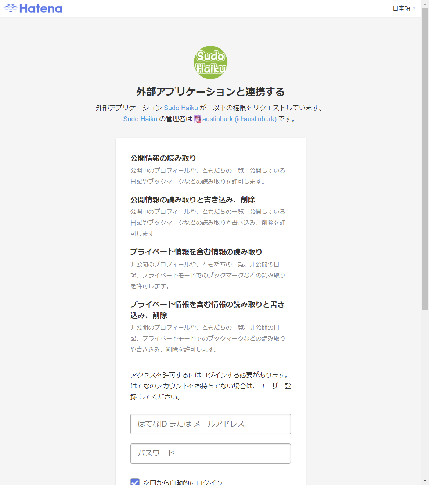
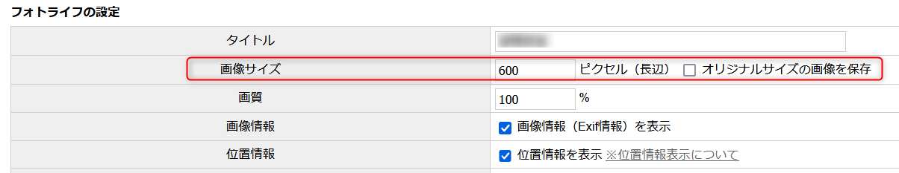
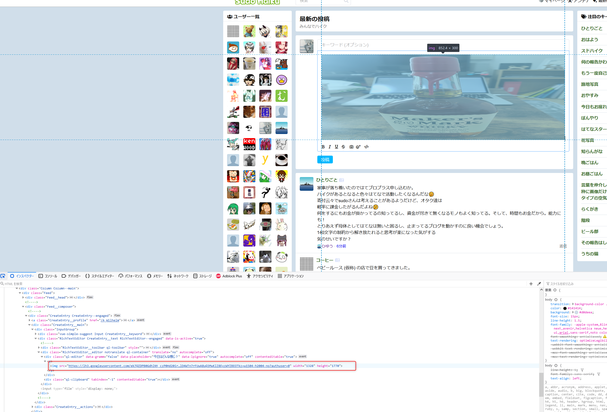

# SudoHaiku完全攻略Wiki
## このヘルプについて
SudoHaikuでよく見かける？質問を2boが雑にまとめたものです。  
SudoHaikuは開発が現在も進んでいるため、この内容の正確性は保証されません。

## SudoHaikuについて
このページを読んでいる時点で説明は不要だと思いますが、[SudoHaiku](https://h.sudo.ne.jp/) はアメリカ在住の[Sudofox](https://profile.hatena.ne.jp/austinburk/) さんが個人で
[はてなハイク](http://h.hatena.ne.jp/) に似せて開発しているサービスです。

**認証等ははてなのサービスを利用していますが、はてな社が提供しているサービスではありません**

## よくある質問
### 登録時の許可内容について

SudoHaikuの初回ログイン時に上の画像のような、はてなとの連携許可が求められます。  
セキュリティに気をつけている方は権限が多いと気になるかもしれません。

[Sudofoxさんの回答](https://h.sudo.ne.jp/austinburk/entry/291966505422295040)は以下となります。(2boの意訳ですので正確な情報は上記リンクを確認ください。)

- プライベート情報を含む情報の読み取りと書き込み、削除  
  Fotolifeへのアップロード、アップロード後の検証をするために必要となります。

- プライベート情報を含む情報の読み取り  
  通知のために必要です。SodoHaikuで通知を生成し、はてからのお知らせを利用して通知しています。

- 公開情報の読み取りと書き込み、削除  
  はてなブックマークとの連携機能のために必要です。  
  なお、この機能は現在開発中です。

- 公開情報の読み取り  
  認証やはてなIDの確認のために必要です。

### イメージ(画像)取り扱い
#### 画像のアップロード先
SudoHaikuでは画像をアップロードすると[Hatena Fotolife](https://f.hatena.ne.jp/) にアップロードされます。  
アップロードされた画像はフォルダ「Sudo::Haiku::Web」(デフォルトで公開範囲は「自分のみ」)に保存されます。  
なお、Fotolifeにアップロードされるため、Fotolifeの制限である「アップロードは毎月300MBまで」の制限が適用されます。

また、**SudoHaikuの投稿を削除してもFotolife上の画像は削除されませんのでご注意ください。**

#### Fotolifeの制限回避方法
Fotolifeの制限であるアップロードは毎月300MBまで」の制限が適用されるため、フォトライフの設定によっては数枚の画像をアップロードするだけで上限を超えてしまいます。
Fotolifeで以下の設定をすることでアップロードサイズを抑えることができます。

- 設定内容
    1. 画像サイズを600ピクセル程度にする
    2. 「オリジナルサイズの画像を保存」のチェックを外す

#### コピー&ペーストでの貼り付け
Webブラウザ上で他のページの画像を右クリック・コピーしSudoHaikuに貼り付けて投稿する画像も表示され、一見投稿できるように見えます。

しかし、SudoHaiku側ではURLでの書き込みとして認識され、Fotolifeにアップロードされないため、1日程度経過した後に画像が見えなくなります。

OSとブラウザの組み合わせで現象の発生度合いは変わりますが、現在はコピー&ペーストで画像を投稿するのは避けたほうがいいです。

**詳しい人向け**
確認したい場合は以下の画像のようにWebブラウザの開発者ツールでアップロードした画像のURLを確認してください。  
FotolifeのURLではなく、他のページのURL(画像ではgoogle)となっている場合はFotolifeにアップロードされず、数日で画像が見えなくなります。

## 寄付や支援について
芝刈り機を送りたいですが、現状では寄付等の支援で公開された情報はありません。

## 日本語化
SudoHaikuの日本語化は[sudo-haiku-locales](https://github.com/sudofox/sudo-haiku-locales) で作成されています。  
また、微妙な翻訳等はキーワード「[スドハイク](https://h.sudo.ne.jp/keyword/291501547806920704) 」で議論されています。

